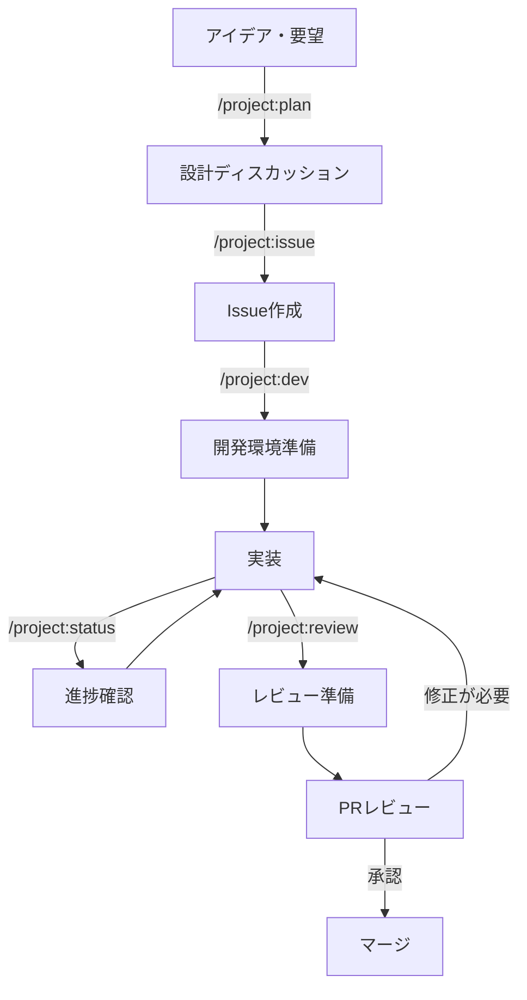

# 開発フローガイド

このドキュメントでは、Claude Code Chatプロジェクトの開発フローを説明します。各段階で「やるべきこと」と「やるべきではないこと」を明確にし、効率的な開発を支援します。

## 📋 目次

1. [開発フローの全体像](#開発フローの全体像)
2. [Phase 1: アイデア・設計段階](#phase-1-アイデア設計段階)
3. [Phase 2: Issue作成段階](#phase-2-issue作成段階)
4. [Phase 3: 開発準備段階](#phase-3-開発準備段階)
5. [Phase 4: 実装段階](#phase-4-実装段階)
6. [Phase 5: レビュー段階](#phase-5-レビュー段階)
7. [Phase 6: マージ・完了段階](#phase-6-マージ完了段階)
8. [スラッシュコマンドリファレンス](#スラッシュコマンドリファレンス)

## 開発フローの全体像



## Phase 1: アイデア・設計段階

### 🟢 やるべきこと

1. **要件の明確化**
   ```
   /project:plan 新機能: ユーザー認証システムの実装
   ```
   - 実装したい機能の目的を説明
   - ユーザーストーリーを定義
   - 期待される成果物を明確化

2. **技術調査**
   - 既存コードの確認
   - 必要なライブラリの調査
   - 技術的制約の確認

3. **実現可能性の検証**
   - プロトタイプの作成（必要に応じて）
   - パフォーマンスへの影響評価

### 🔴 やるべきではないこと

- ❌ 詳細な実装に着手する
- ❌ mainブランチで実験的なコードを書く
- ❌ Issueを作成せずに開発を始める
- ❌ 他の開発者との相談なしに大きな設計変更を決定

## Phase 2: Issue作成段階

### 🟢 やるべきこと

1. **Issueの作成**
   ```
   /project:issue
   ```
   - 明確なタイトルをつける
   - 背景と目的を記載
   - 受け入れ条件を定義
   - 技術的な実装方針を記載

2. **適切なラベル付け**
   - `enhancement`（新機能）
   - `bug`（バグ修正）
   - `documentation`（ドキュメント）
   - 優先度ラベル（`priority:high`など）

3. **関連Issueのリンク**
   - 依存関係の明確化
   - ブロッカーの特定

### 🔴 やるべきではないこと

- ❌ 曖昧な説明でIssueを作成
- ❌ 受け入れ条件なしでIssueを作成
- ❌ 複数の機能を1つのIssueにまとめる
- ❌ 実装の詳細をIssueタイトルに含める

## Phase 3: 開発準備段階

### 🟢 やるべきこと

1. **開発環境の準備**
   ```
   /project:dev 5
   ```
   （Issue #5の開発を開始）
   
   - mainブランチから最新を取得
   - featureブランチを作成
   - Draft PRを即座に作成

2. **開発計画の確認**
   - Issueの内容を再確認
   - 必要なファイルの特定
   - テスト計画の立案

### 🔴 やるべきではないこと

- ❌ mainブランチで直接作業
- ❌ 古いブランチから分岐
- ❌ PRを作成せずに開発を進める
- ❌ Issue番号なしでブランチを作成

## Phase 4: 実装段階

### 🟢 やるべきこと

1. **こまめなコミット**
   - 機能単位でコミット
   - わかりやすいコミットメッセージ
   ```bash
   git commit -m "[Issue #5] Add user authentication endpoint"
   ```

2. **定期的な進捗確認**
   ```
   /project:status
   ```
   - 変更内容の確認
   - テストの実行
   - CIの状態確認

3. **コードの品質維持**
   - TypeScriptの型安全性
   - ESLintルールの遵守
   - 適切なエラーハンドリング

### 🔴 やるべきではないこと

- ❌ 大量の変更を1つのコミットにまとめる
- ❌ テストなしでコミット
- ❌ ビルドエラーのままプッシュ
- ❌ console.logを残したままコミット
- ❌ 秘密情報をコードに含める

## Phase 5: レビュー段階

### 🟢 やるべきこと

1. **レビュー準備**
   ```
   /project:review
   ```
   - すべてのテストが通ることを確認
   - Lintエラーの解消
   - ドキュメントの更新

2. **PRの更新**
   - Draft状態を解除
   - PR説明文の充実
   - スクリーンショットの追加（UI変更時）
   - レビュアーの指定

3. **レビューへの対応**
   - フィードバックへの迅速な対応
   - 変更内容の説明
   - 追加テストの実装

### 🔴 やるべきではないこと

- ❌ テスト失敗のままレビュー依頼
- ❌ PR説明なしでレビュー依頼
- ❌ レビューコメントを無視
- ❌ 大きな変更を後から追加

## Phase 6: マージ・完了段階

### 🟢 やるべきこと

1. **マージ前の最終確認**
   - CIがすべて通っている
   - レビュー承認を得ている
   - コンフリクトが解決されている

2. **適切なマージ方法**
   - Squash mergeを使用
   - わかりやすいマージコミットメッセージ

3. **マージ後の処理**
   - featureブランチの削除
   - 関連Issueのクローズ
   - リリースノートの更新（必要に応じて）

### 🔴 やるべきではないこと

- ❌ レビュー未完了でマージ
- ❌ CI失敗のままマージ
- ❌ ブランチを削除せずに放置
- ❌ Issueをオープンのまま放置

## スラッシュコマンドリファレンス

### `/project:plan` - 設計ディスカッション
```
/project:plan ユーザー認証機能の追加
```
**用途**: 新機能や改善のアイデアを議論し、技術的な実現可能性を検討

### `/project:issue` - Issue作成
```
/project:issue
```
**用途**: 議論した内容をもとにGitHub Issueを作成

### `/project:dev {issue-number}` - 開発開始
```
/project:dev 5
```
**用途**: 指定したIssueの開発環境をセットアップ（ブランチ作成、Draft PR作成）

### `/project:status` - 状況確認
```
/project:status
```
**用途**: 現在の開発状況を確認（ブランチ、変更ファイル、PR状態）

### `/project:review` - レビュー準備
```
/project:review
```
**用途**: PRをレビューに出す前の最終チェック（テスト、Lint、差分確認）

### `/project:quick-issue` - 素早いIssue作成
```
/project:quick-issue バグ修正: ログイン画面のエラー
```
**用途**: 最小限の対話で素早くIssueを作成（シンプルなバグ修正や小さなタスクに最適）

## ベストプラクティス

### コミットメッセージ
```
[Issue #N] 動詞で始まる簡潔な説明

- 詳細な変更内容（必要に応じて）
- 関連する技術的な決定事項
```

### PR作成時の注意点
1. **タイトル**: `[Issue #N] 機能の簡潔な説明`
2. **説明文**:
   - 変更の概要
   - 実装のアプローチ
   - テスト方法
   - スクリーンショット（UI変更時）

### コードレビューの観点
- ✅ 要件を満たしているか
- ✅ コードの可読性
- ✅ パフォーマンスへの影響
- ✅ セキュリティの考慮
- ✅ テストカバレッジ

---

## 困ったときは

- 技術的な質問: Issueでディスカッション
- 緊急の問題: プロジェクトリードに直接連絡
- ドキュメント不足: ドキュメント改善のIssueを作成

このガイドラインに従うことで、効率的で品質の高い開発が可能になります。